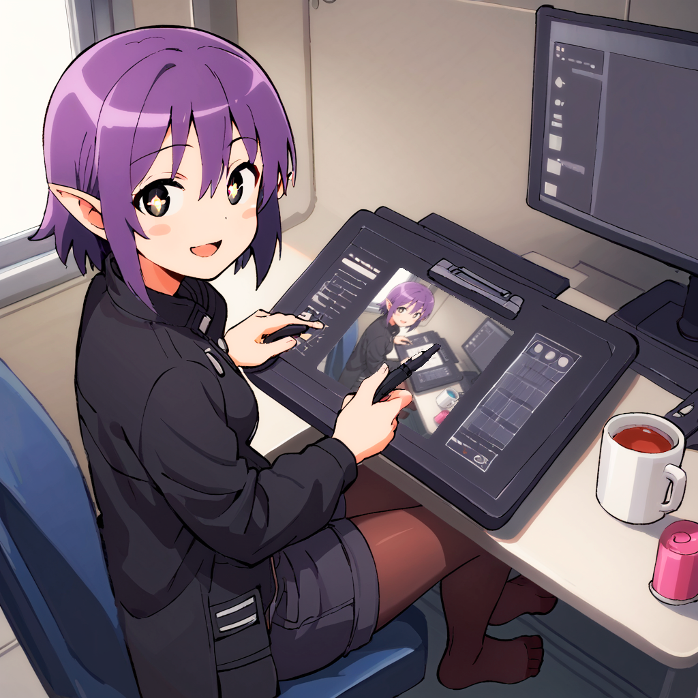
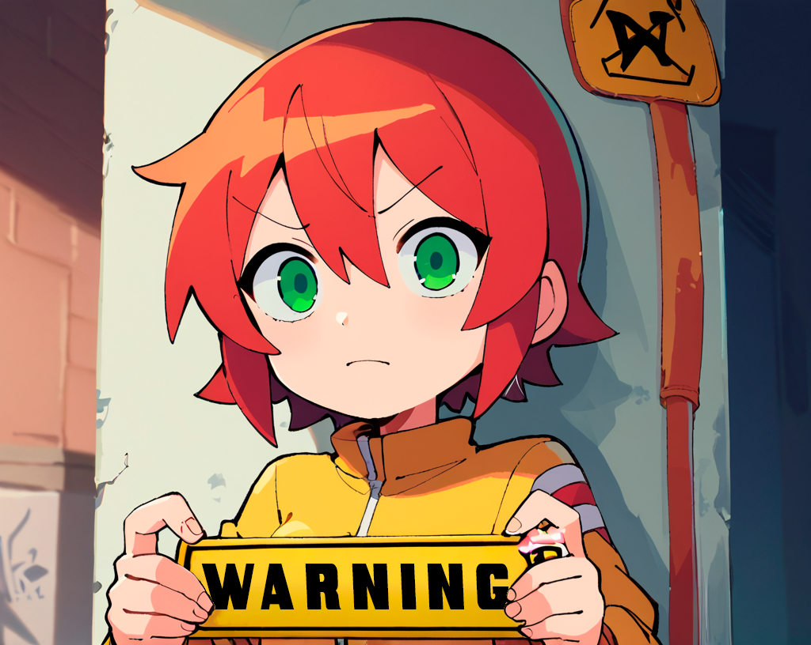
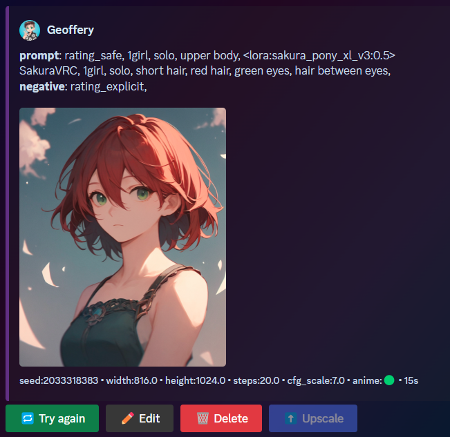

# Yume Stable Diffusion Bot
A Discord Bot that interfaces with the [AUTOMATIC1111/stable-diffusion-webui](https://github.com/AUTOMATIC1111/stable-diffusion-webui) api to generate AI images. 

### Warning this bot is still under construction and mostly custom built for my server

## Table of Contents
* [Preview](#preview)
* [Commands](#commands)
* [Requirements](#requirements)
* [License](#license)

### Preview

## Commands
* \dream - The main txt2img command

# Requirements
* Python 3.10
* [AUTOMATIC1111/stable-diffusion-webui](https://github.com/AUTOMATIC1111/stable-diffusion-webui)

 
## License
Yume Stable Diffusion Bot is protected under [GNU General Public License v3.0](https://github.com/Geoffery10/Yume-Stable-Diffusion-Bot/blob/main/LICENSE)
